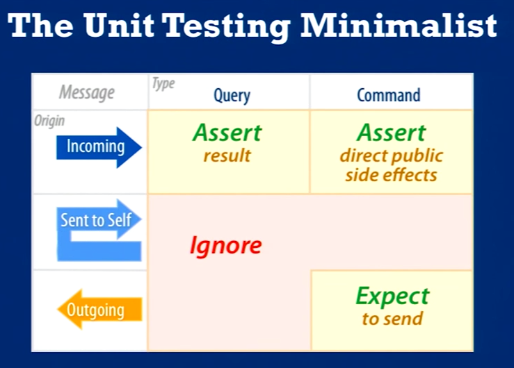

# Testing

## General Best-Practices
Keep your tests self-contained, not relying on [shared state](https://robots.thoughtbot.com/lets-not), setup in `beforeEach` blocks. This makes your tests easier to [reason about](https://robots.thoughtbot.com/mystery-guest) and minimizes the possibility of flaky tests.

> If you're tempted to share state for performance reasons, don't do so until you have actually identified a problematic test.[*](http://wiki.c2.com/?PrematureOptimization) Also realize that sharing state between tests eliminates the possibility to parallelize your tests, so you may end up with slower test run times overall by introducing state.

Make liberal use of [factories](https://github.com/rosiejs/rosie) to prevent your tests from being brittle, and allowing each test to only be concerned with the specific case/data it's concerned with. Ensure these factories are the [bare minimum](https://robots.thoughtbot.com/factories-should-be-the-bare-minimum) to avoid confusing test results and to keep your tests focused.

**Organize tests into [stages](https://robots.thoughtbot.com/four-phase-test)**
1. Setup/Arrange
1. Exercise/Act
1. Verify/Assert
1. (Teardown)

<details>
  <summary>Example (Using React + Enzyme):</summary>

```jsx
test('renders stat and label of currently selected datum', () => {
  // Setup/Arrange
  const data = [
    { x: 'Cats', y: 2 },
    { x: 'Dogs', y: 17 },
  ];

  // Exercise/Act
  const root = mount(<DoughnutChart data={data} />);
  const subject = root.find('VictoryPie').find(HighlightableSlice).at(1);
  subject.simulate('mouseover');

  // Verify/Assert
  const stat = root.find('.highlight-stat').text();
  const label = root.find('.highlight-label').text();
  expect(stat).toBe('17');
  expect(label).toBe('Dogs');
});
```
</details>

## Terminology
**Unit/System Under Test (SUT)/Test Subject** — This is probably one of the most difficult term to define, and one of the most contentious. But the basic notion of the “unit” in “unit testing” is the simplest piece of self-contained functionality. It could be as simple as a method, or as complex as a class, but should be isolated sufficiently from collaborators using strategies such as dependency injection (DI) or mocking (discussed later).

**Test Double[*](http://xunitpatterns.com/Test%20Double.html)** - A generic term for any kind of pretend object used in place of a real object for testing purposes.
* Fake — An object that actually has a working implementation, but usually takes some shortcut which makes it not suitable for production (an [in-memory database](https://martinfowler.com/bliki/InMemoryTestDatabase.html) is a good example, as is [redux-mock-store](https://github.com/arnaudbenard/redux-mock-store)).
* Dummy - An object passed around but never actually used in the code path the test is exercising. Usually they are just used to fill parameter lists.
* Stub - An object which provides canned answers to calls made during the test.
* Spy - A Stub that also records some information based on how it was called (how many times and with what parameters).
* [Mocks](https://martinfowler.com/articles/mocksArentStubs.html) - A spy with pre-programmed expectations.



Resources:
https://martinfowler.com/articles/mocksArentStubs.html
https://robots.thoughtbot.com/four-phase-test
https://robots.thoughtbot.com/lets-not
https://robots.thoughtbot.com/factories-should-be-the-bare-minimum
https://robots.thoughtbot.com/mystery-guest
https://www.youtube.com/watch?v=R9FOchgTtLM
http://xunitpatterns.com/Test%20Double.html

# Error Handling
**Store error messages in external file (don't be afraid to be verbose). Allow string interpolation via sprintf.**

# Writing Better Functions[*](https://www.youtube.com/watch?v=T8J0j2xJFgQ)
1. Gather Input
1. Perform Work
1. Deliver Results
1. Handle Errors

# Variable/Function Naming
* Good names
  1. Reveal the intention (http://wiki.c2.com/?IntentionRevealingNames, http://wiki.c2.com/?IdentifiersRevealIntent, http://wiki.c2.com/?IntentionRevealingSelector)
  1. Hide the implementation
  1. Give a clear hint as to the expected return type
* Name a method after *what* it does, not *how* it does it or *why* (i.e. name a method after its reason for existence, or its "essence")
* Examples:

Good identifier: `sortVectorIntoAlphaOrder(vector & v)`

Bad identifier: `collateCustomerNames(vector & v)`
  - To test a name: Imagine a second very different implementation. Will the name work for both implementations?
	- Booleans
	- Constants
  "name services after what they do, and postpone the why until the point of usage."

# Exceptions
Stop throwing them. Stop using them for control flow.[*](https://www.joelonsoftware.com/2003/10/13/13/)

# Language theory
Named parameters are nice.

# Git

## Branching Strategy
[TODO: Add note for app code]
[TODO: Add note for library code]

## Merging Strategies
[TODO: Always rebase? Always create merge commit?]

**Branch Name Format**
In shared repos, it's helpful to prepend your branch names with your name, so you know which branch belongs to which dev (e.g. `dla/my-cool-feature`).

## Commit Message Format
* Limit subject line to 50 characters.
* Separate subject from body with blank line.
* Capitalize subject line.
* Do not end subject line with a period.
* Use imperative mood in subject line.
* Hard-wrap body at 72 characters.
* Use body to explain *what* and *why*, not *how*
Reference any fixed/related issues at the end of the body, following a blank line. Example (Refs/Fixes #532).
* Prepend subject with a pre-defined tag. (This is especially nice for generating change logs.)[*](https://eslint.org/docs/developer-guide/contributing/pull-requests#step-2-make-your-changes)
  * Fix - Bug fix.
  * Update - Backwards-compatible enhancement.
  * New - New feature.
  * Breaking - Backwards-incompatible enhancement or feature.
  * Docs - Change to documentation only.
  * Build - Change to build process only.
  * Upgrade - Dependency upgrade.
  * Chore - Refactoring, adding tests, etc. (anything that isn’t user-facing).

Example:
```
Fix: Improve chart rendering performance.

Our charting dashboard was starting to lag with more than 200 data
points. This changeset fixes that and adds performance tests to prevent
regressions.

Fixes #926.
```

# Workflow

1. Write broken test
1. Write code to fix test
1. Refactor
1. Rename
1. Make commit
1. Squash commits
