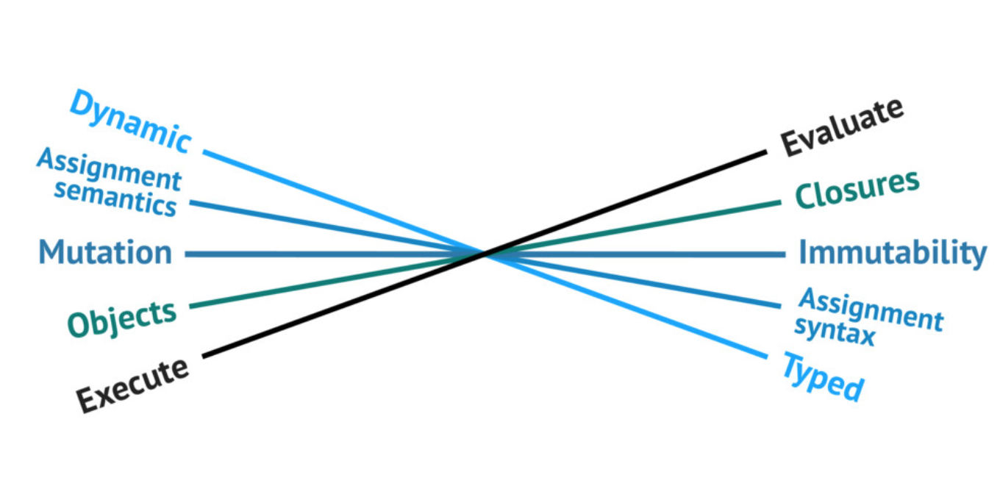

## OOP is dead only if FP is dead
Describes the core differences between those paradigms, and how they can coexist

References:
https://speakerdeck.com/staltz/oop-is-dead-only-if-fp-is-dead

## Functional Design Patterns

https://www.youtube.com/watch?v=srQt1NAHYC0
