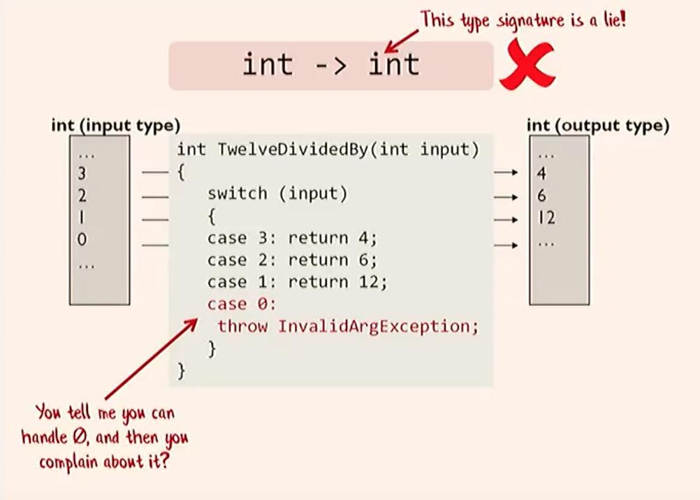
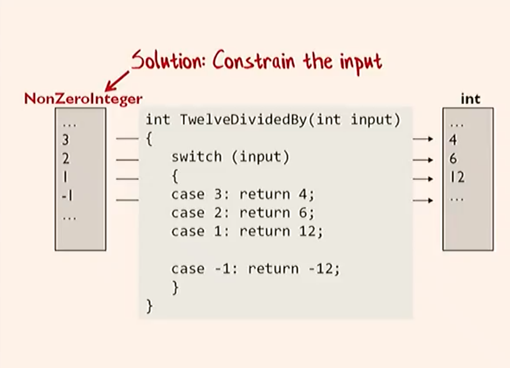
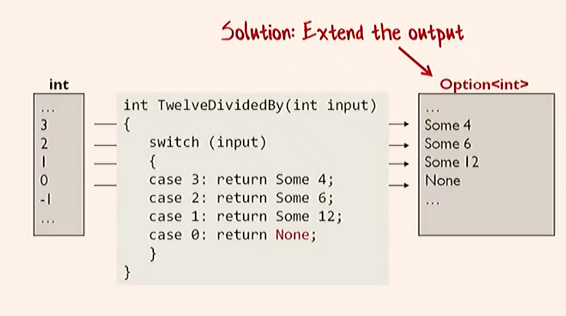
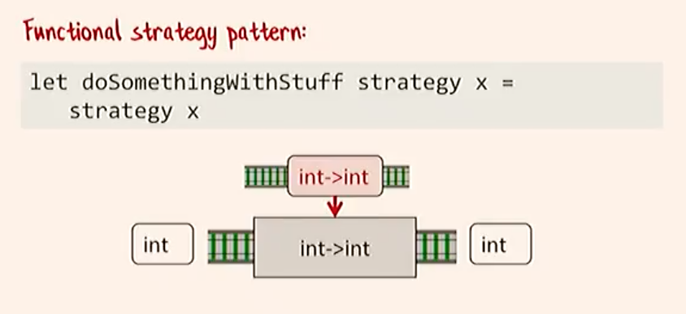

# Language Divisions
Paradigm:   Object Oriented vs. Functional
Evaluation: Strict vs. Non-strict vs. Lazy
Typing:     Static vs. Dynamic, Strong vs. Weak, Manifest vs. Inferred, Nominal vs. Structural, Duck typing/structural typing
Typing2:    Weak vs. Strong

Subtyping Polymorphism
Parametric Polymorphism
Ad-Hoc Polymorphism
Row Polymorphism
Higher-Kinded Polymorphism
Multiple Inheritence
Subtyping Inheritence
Implementation Inheritence
Higher-kinded Types
Higher-rank Types
Existential Types
Type Constructors
Type Operators

## Other
Protocols
Mixins

# FP and OOP
Cross-pollination between FP and OOP: https://www.youtube.com/watch?v=iSmkqocn0oQ

# Typing Discipline [TODO]

* Strong vs weak
Very contentious

Strongly-typed languages enforce types to be unambiguously distinguishable at compile-time (no implicit type conversions).
Weakly-typed languages allow for implicit type conversions (coercions) to be made.

Most common are type promotions (widening coercion), where types are converted to a parent types for compatability:

```java
int x = 3;
double y = 3.5;
System.out.println(x + y); // 6.5
```

In reality, not so much a binary as a continum.
Strongly typed (fewer implicit type casts) <---------> Weakly typed (more implicit type cases)

If being pedantic, Java is not strongly typed, but Elm and OCaml are. JavaScript is VERY weakly typed.

* Static vs dynamic
* Manifest vs inferred
* Nominal vs structural
* Duck typing/structural typing

Duck typing happens dynamically (via runtime type checks)
Structural typing happens statically (via type inference)

# Language Features

## Single-Dispatch[\*](http://wiki.c2.com/?SingleDispatch)
A type of polymorphism where a single object's type is examined at runtime in order to determine what method to call. This is the type of polymorphism you see in languages like Java where it uses the concrete runtime type of the object the method is called on to determine which method implementation to execute.

```java
Shape rect = new Rectancle();
Shape circle = new Circle();
rect.draw(); // Calls Rectangle's draw method
circle.draw(); // Calls Circle's draw method
// ^ type of object (implicit parameter) before the dot is examined to determine
//   which method to call.
```

## Duck-Typing
A style of dynamic typing in which an object's current set of methods and properties determines the valid semantics, rather than its inheritance from a particular class.

* Languages that implement single-dispatch: Java, C++, Smalltalk, etc.

## Multiple-Dispatch (Multi-Method)[\*](http://wiki.c2.com/?MultipleDispatch)
* A type of polymorphism where multiple object's types are examined at runtime in order to determine which method to dispatch.
* Not the same thing as operator overloading! That only takes the static types into account, as shown in the below example.

```java
class Appraiser {
  public void Appraise (Vehicle v) { println ("Appraising a vehicle..."); }
  public void Appraise (Tractor t) { println ("Appraising a tractor..."); }
}
class TractorHead extends Appraiser {
  public void Appraise (Vehicle v) { println ("Boring...");           }
  public void Appraise (Tractor t) { println ("I LOVE TRACTORS!!!!"); }
}
Appraiser myAppraiser = new TractorHead();
Vehicle myVehicle = new Tractor();
myAppraiser.Appraise(myVehicle); // Outputs: "Boring..."
// Uses myAppraiser's type to determine dispatch, but not myVehicle's.
```

* Languages that implement multi-methods: Dylan, LISP

## Operator Overloading
* Allowing functions (or methods) of the same name to exist, being differentiated by the number and/or static types of arguments it receives.
* Uses early-binding.

## External Polymorphism
Any mechanism for implementing polymorphism external to definition of object displaying polymorphic behavior (e.g. `switch(type)`).

# Object-Oriented Programming
## Core Concepts
* Associate behavior with data.
* All about messaging
* Modeled after cells. Independent cells make up an organism. Cells can only communicate via messages.
* Was **not** about data. The call/whole concept was meant to do away with data.
* Objects have associated algebras
* Objects can live in families (Alan Kay left out inheritance initially since he didn't like how Simula implemented it)

Distilled further: OOP is about message-passing, retaining, protecting, and hiding state, and late-binding of all things (to allow for dynamic dispatch aka polymorphism).

## Problems

### with Inheritence
1. It is inflexible. Most (if not all) domains cannot be well represented by a strict tree-like taxonomy single inheritence systems require. Example: A `Dog` is an `Animal`, but it can also be a `Pet`.
2. Child classes can inherit behavior or be forced to implement that doesn't pertain to it (example: Caterpillar being force to implement `speak`). This breaks the Liskov Substitution Principle.
3. Fragile base class[\*](https://en.wikipedia.org/wiki/Fragile_base_class).

### Problems with Classes
1. Useful code is unnecessarily tied to a class and subclassing is often the only way to utilize it.

### Solutions?

Multiple inheritence is one solution, but that leads to ambiguity in cases where both base classes implement a particular method. Explicit composition is a superior option. An example in JavaScript:

```js
const Dalmation = spec => {
  // spec = specification
  const {name} = spec;

  // Composition! Only use the bits of objects that you need!
  const {bark} = Dog(spec);
  const {feed} = Pet(spec);

  const chaseFireEngine = () => console.log("Don't stereotype me.");

  return Object.freeze({ bark, feed, chaseFireEngine });
};
```

The beauty here is that you can reuse code without dealing with inheritance, or any sort of class-based hierarchy.

References:
http://fitzgeraldnick.com/2010/12/31/oop-the-good-parts.html
https://github.com/raganwald-deprecated/homoiconic/blob/master/2010/12/oop.md#readme
http://lists.squeakfoundation.org/pipermail/squeak-dev/1998-October/017019.html
http://userpage.fu-berlin.de/~ram/pub/pub_jf47ht81Ht/doc_kay_oop_en

## Future
Will FP overtake OOP?

# Functional Programming

## Terminology
"Treated as data" = passed as arguments, returned from function calls, bound to variable names, assigned to a data structure, etc.

* Lambda - An anonymous function defined inline, treated as data.
```js
node.on('click', () => alert('clicked'));
```
* Anonymous function - Any unnamed function. Same as lambda.
* Closure - A function and its lexical scope. "Closes over its environment." Can access variables not in its parameter list.
```js
const add = a => {
  return b => {
    // I can access 'a' here!
    return a + b;
  };
};
```
* First-class function - A function which can be treated as data. Must support anonymous functions. Named functions are treated like regular variables with a function type.
* Higher order function (HOF) - A function which takes another function as an argument, returns a function as its result, or both. (Both `add` and `node.on` in the example above are HOFs.)

## Core Principles
* Functions as values/data
* Function Composition
* Algebraic Data Types != classes - They are a set of data  
Record (`AND`): `type snack = { fruit: Fruit, vegtable: Vegtable }`  
Union (`OR`): `type snack = Fruit | Vegtable`
* Don't throw Exceptions. They break function's contract.[\*](https://youtu.be/srQt1NAHYC0?t=18m38s)







* Laziness
* Partial Application (Currying)
* Monadic Bind (Chaining)

#### Single Responsibility
Write granular functions.

#### Open-Closed
Function composition. Use composition to extend another function instead of modifying said function.

#### ~~Liskov Substitution~~
No classes, so a non-issue.

#### Interface Segregation
Interface segregation taken to its extreme means every interface has only one method. An interface with one method is just a function type.




#### ~~Dependency Inversion~~
Pretty much get this for free as there are no concrete classes in FP (see [Interface Segregation](#interface-segregation)) just interfaces via function types.

## OOP Design Patterns in FP

#### ~~Singleton~~
Not possible in pure FP. This is a good thing. You should inject your dependencies. Not rely on global state (which is what singletons are).

#### ~~Factory~~
Get this for free. Every "constructor" is a factory function.

#### Command, Strategy, Template, Observer
First class functions.

#### Strategy
First class functions.

#### Object Pool
Can add this functionality without breaking callers, since objects are not instantiated via `new`, but rather via a factory function.[\*](https://medium.com/javascript-scene/javascript-factory-functions-vs-constructor-functions-vs-classes-2f22ceddf33e#109e)

References:
https://www.youtube.com/watch?v=srQt1NAHYC0

## Monads

Five most important monads:
1. Maybe
2. Either
3. Future/Task
4. I/O
5. Reader

References:
https://monet.github.io/monet.js/
https://www.youtube.com/watch?v=SfWR3dKnFIo

# The Perfect Language (According to Danny)
## Type Discipline
Strong - Static - Type-Inference

## Syntax
### Comments
`#` - Single-Line. No multi-line comments.

### Basic Types
| Type              | Literal Form(s)                   |
| ---               | ---                               |
| Integer           | `23531`, `23_531`, `16r5beb`      |
| Float             | `12.34`, `1234e-2`, `1.234e`      |
| Boolean           | `True`,  `False`                  |
| String            | `"abc"`, `"""multiline"""`        |
| *Character*       | `'a'`                             |
| *Symbol*          | `#foo`, `#'foo with whitespace'`  |
| List              | `[1, 2, 3]`                       |
| Record            | `point = { x = 3, y = 4 }`        |
| Tuple             | `(1, "hi", False)`                |

### Operators
| Operator              | Example                                       |
| ---                   | ---                                           |
| Integer Arithmetic    | `1 + 2 - 3 * 4 / 5 ^ 6`                       |
| *Integer Modulo*      | `3 % 2`                                       |
| *Float Arithmetic*    | `1 +. 2 -. 3 *. 4 /. 5 ^. 6`                  |
| Comparison            | `>`, `<`, `>=`, `=<`, `!=`, `==`              |
| String Concatenation  | `"Hello " ++ "World"`                         |
| Boolean Operators     | `!`, `&&`, `||`                               |
| Spread                | `[...rest, b]`, `{...theRest, a = newValue}`  |

### Patterns

### Features
* Keyword arguments
* new Rectangle(100, 200); vs. Rectangle width: 100 height: 200
* Higher order types (type classes or the like)
* Type inference
* Variant types
* Pattern matching
